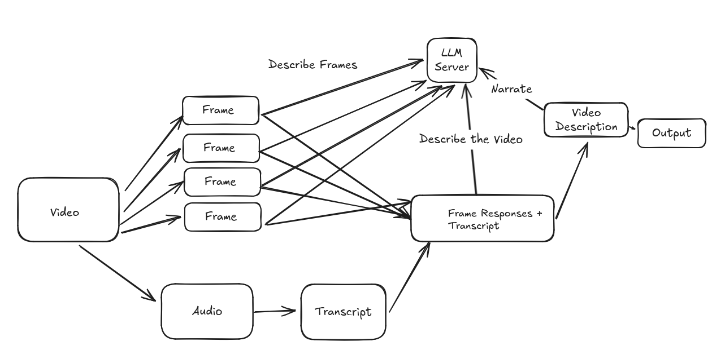

# Video Analysis using Llama3.2 Vision and OpenAI's Whisper Models locally

A video analysis tool that combines Llama's 11B vision model and Whisper to create a description by taking key frames, feeding them to the vision model to get details. It uses the details from each frame and the transcript, if available, to describe what's happening in the video. 

## Features
- 💻 Can run completely locally - no cloud services or API keys needed
- ☁️  Or, Leverage openrouter's LLM service for speed and scale
- 🎬 Intelligent key frame extraction from videos
- 🔊 High-quality audio transcription using OpenAI's Whisper
- 👁️ Frame analysis using Ollama and Llama3.2 11B Vision Model
- 📝 Natural language descriptions of video content
- 🔄 Automatic handling of poor quality audio
- 📊 Detailed JSON output of analysis results
- ⚙️ Highly configurable through command line arguments or config file

## Design
The system operates in three stages:

1. Frame Extraction & Audio Processing
   - Uses OpenCV to extract key frames
   - Processes audio using Whisper for transcription
   - Handles poor quality audio with confidence checks

2. Frame Analysis
   - Analyzes each frame using vision LLM
   - Each analysis includes context from previous frames
   - Maintains chronological progression
   - Uses frame_analysis.txt prompt template

3. Video Reconstruction
   - Combines frame analyses chronologically
   - Integrates audio transcript
   - Uses first frame to set the scene
   - Creates comprehensive video description



## Requirements

### System Requirements
- Python 3.11 or higher
- FFmpeg (required for audio processing)
- When running LLMs locally (not necessary when using openrouter)
  - At least 16GB RAM (32GB recommended)
  - GPU at least 12GB of VRAM or Apple M Series with at least 32GB

### Installation

1. Clone the repository:
```bash
git clone https://github.com/byjlw/video-analyzer.git
cd video-analyzer
```

2. Create and activate a virtual environment:
```bash
python3 -m venv .venv
source .venv/bin/activate  # On Windows: .venv\Scripts\activate
```

3. Install the package:
```bash
pip install .  # For regular installation
# OR
pip install -e .  # For development installation
```

4. Install FFmpeg:
- Ubuntu/Debian:
  ```bash
  sudo apt-get update && sudo apt-get install -y ffmpeg
  ```
- macOS:
  ```bash
  brew install ffmpeg
  ```
- Windows:
  ```bash
  choco install ffmpeg
  ```

### Ollama Setup

1. Install Ollama following the instructions at [ollama.ai](https://ollama.ai)

2. Pull the default vision model:
```bash
ollama pull llama3.2-vision
```

3. Start the Ollama service:
```bash
ollama serve
```

### OpenRouter Setup (Optional)

If you want to use OpenRouter instead of Ollama:

*Currently you can use llama 3.2 11b vision for free, and the default config uses this version automatically!*

1. Get an API key from [OpenRouter](https://openrouter.ai)
2. Either:
   - Pass it via command line: `--openrouter-key your-api-key`
   - Or add it to config/config.json:
     ```json
     {
       "clients": {
         "default": "openrouter",
         "openrouter": {
           "api_key": "your-api-key"
         }
       }
     }
     ```

## Project Structure

```
video-analyzer/
├── config/
│   └── default_config.json
├── prompts/
│   └── frame_analysis/
│       ├── frame_analysis.txt
│       └── describe.txt
├── output/             # Generated during runtime
├── video_analyzer/     # Package source code
└── setup.py           # Package installation configuration
```

## Usage

### Basic Usage

Using Ollama (default):
```bash
video-analyzer path/to/video.mp4
```

Using OpenRouter:
```bash
video-analyzer path/to/video.mp4 --openrouter-key your-api-key
```

#### Sample Output
```
Transcript:
 Happy birthday to you!

Enhanced Video Narrative:
Here are the descriptions of what's happening in each frame:

**Frame 1 (2.50s)**
A woman enters a bedroom with a tray of breakfast items. She is wearing a white robe and holding a wooden tray, accompanied by a young girl with blonde hair who is smiling.

**To Frame 2 (4.50s)**
The woman moves to the right side of the image, still holding the tray of food and drinks. The young girl looks up at something outside the frame, while two other young girls with blue hoodies stand behind the woman, all smiling.

**To Frame 3 (5.00s)**
The woman holds the tray of food and drinks in front of the camera, with the two young girls with blue hoodies standing behind her. The food and drinks on the tray are assorted colors.

**To Frame 4 (5.50s)**
The woman moves slightly to the right and now holds the tray in front of a bunk bed. A blue curtain is visible behind the bunk bed, and she is wearing a white jacket.

**To Frame 5 (6.00s)**
The woman holds the tray in the center of the image, with a bed with a pink pillow visible against the wall to her right. She is now wearing a white shirt.

Note: The audio transcript indicates that "Happy Birthday to You!" is being sung, suggesting that this scene is taking place during a birthday celebration.
```

### Advanced Usage

```bash
video-analyzer path/to/video.mp4 \
    --config custom_config.json \
    --output ./custom_output \
    --client openrouter \
    --openrouter-key your-api-key \
    --model llama3.2-vision \
    --frames-per-minute 15 \
    --duration 60 \
    --whisper-model medium \
    --keep-frames
```

### Command Line Arguments

| Argument | Description | Default |
|----------|-------------|---------|
| `video_path` | Path to the input video file | (Required) |
| `--config` | Path to configuration directory | config/ |
| `--output` | Output directory for analysis results | output/ |
| `--client` | Client to use (ollama or openrouter) | ollama |
| `--ollama-url` | URL for the Ollama service | http://localhost:11434 |
| `--openrouter-key` | API key for OpenRouter service | None |
| `--model` | Name of the vision model to use | llama3.2-vision |
| `--frames-per-minute` | Target number of frames to extract | 10 |
| `--duration` | Duration in seconds to process | None (full video) |
| `--whisper-model` | Whisper model size | medium |
| `--keep-frames` | Keep extracted frames after analysis | False |
| `--log-level` | Set logging level (DEBUG, INFO, WARNING, ERROR, CRITICAL) | INFO |

## Configuration

The tool uses a cascading configuration system:
1. Command line arguments (highest priority)
2. User config (config/config.json)
3. Default config [config/default_config.json](config/default_config.json)

### Configuration Options

#### General Settings
- `clients.default`: Default client to use (ollama or openrouter)
- `clients.ollama.url`: URL for the Ollama service
- `clients.ollama.model`: Vision model to use with Ollama
- `clients.openrouter.api_key`: API key for OpenRouter service
- `clients.openrouter.model`: Vision model to use with OpenRouter
- `prompt_dir`: Directory containing prompt files
- `output_dir`: Directory for output files
- `frames.per_minute`: Target number of frames to extract per minute
- `whisper_model`: Whisper model size (tiny, base, small, medium, large)
- `keep_frames`: Whether to keep extracted frames after analysis

#### Frame Analysis Settings
- `frames.analysis_threshold`: Threshold for key frame detection
- `frames.min_difference`: Minimum difference between frames
- `frames.max_count`: Maximum number of frames to extract

#### Response Length Settings
- `response_length.frame`: Maximum length for frame analysis
- `response_length.reconstruction`: Maximum length for video reconstruction
- `response_length.narrative`: Maximum length for enhanced narrative

#### Audio Settings
- `audio.sample_rate`: Audio sample rate
- `audio.channels`: Number of audio channels
- `audio.quality_threshold`: Minimum quality threshold for transcription
- `audio.chunk_length`: Length of audio chunks for processing
- `audio.language_confidence_threshold`: Confidence threshold for language detection

## Output

The tool generates a JSON file (`analysis.json`) containing:
- Metadata about the analysis
- Audio transcript (if available)
- Frame-by-frame analysis
- Final video description

### Example Output Structure

```json
{
  "metadata": {
    "client": "openrouter",
    "model": "meta-llama/llama-3.2-11b-vision-instruct:free",
    "whisper_model": "medium",
    "frames_per_minute": 60,
    "duration_processed": null,
    "frames_extracted": 8,
    "frames_processed": 8,
    "start_stage": 1,
    "audio_language": "en",
    "transcription_successful": true
  },
  "transcript": {
    "text": " I've ever tasted. Good, I'm so happy. I'm glad we did the hot cocoa bombs. It's the  sugary-est though. I'm so glad we got her the hot cocoa.",
    "segments": [
      {
        "text": " I've ever tasted. Good, I'm so happy. I'm glad we did the hot cocoa bombs. It's the",
        "start": 0.0,
        "end": 6.32,
        "words": [
          {
            "word": " I've",
            "start": 0.0,
            "end": 0.26,
            "probability": 0.22717513144016266
          },
          ...
          {
            "word": " the",
            "start": 6.12,
            "end": 6.32,
            "probability": 0.34964463114738464
          }
        ]
      }
    ]
  },
  "frame_analyses": [
    {
      "response": "Frame 0\nThe scene is set in a snowy environment, with a person wearing a light blue hoodie and black pants standing in front of a building. The person is facing away from the camera, and their head is covered with a black and white patterned hat.\n\nAction/Movement\nThe person is standing still, with their arms at their sides. There is no visible movement or action in this frame.\n\nNew Information\nThere are no new objects, people, or text visible in this frame. The background is blurry, but it appears to be a building with windows and a door.\n\nContinuity Points\nThis frame does not provide any continuity points to previous frames, as it is the first frame in the sequence.\n\nKey Continuation Points:\n- The person's clothing and accessories, such as the hat and hoodie, may be important to note for future frames.\n- The building in the background may be a significant location in the narrative.\n- The snowy environment may be a recurring theme throughout the video."
    },
    ...
    {
      "response": "Frame 7 (8.00 seconds)\nSetting/Scene: The snowy environment remains the same, with the building in the background still blurry.\n\nAction/Movement: The person is now walking towards the camera, their pace slightly faster than before. They are looking directly at the camera, and their facial expression appears neutral.\n\nNew Information: There are no new objects, people, or text visible in this frame. The audio remains the same as previous frames.\n\nContinuity Points: The person's clothing and accessories, as well as the building in the background, are consistent with previous frames. The snowy environment continues to be a significant part of the scene.\n\nKey Continuation Points:\n- The direction of the person's movement may indicate a destination or a goal.\n- The person's facial expression and body language may change as they approach the camera.\n- The steady pace of the person's movement may suggest a sense of purpose or urgency."
    }
  ],
  "video_description": {
    "response": "Here is a synthesized video summary based on the provided frame descriptions:\n\n**VIDEO SUMMARY**\n\nDuration: 8 seconds\n\n**Opening Description**\n\nThe video begins with a person standing in a snowy environment, wearing a light blue hoodie and black pants, with a black and white patterned hat covering their head. They are facing away from the camera, with their arms at their sides, and standing in front of a blurry building with windows and a door. The initial tone and context suggest a serene and peaceful atmosphere.\n\n**Narrative Development**\n\nAs the person turns to face the camera in Frame 1, their gaze is directed towards the camera, and their body is slightly turned to the right. This subtle movement sets the stage for their deliberate and purposeful actions throughout the video. In subsequent frames, the person walks towards the camera, their pace steady and purposeful, with their arms still at their sides. Their facial expression remains neutral, but their gaze is fixed on the camera, suggesting a sense of focus or interest. The direction of their movement may indicate a destination or goal, and the steady pace of their movement suggests a sense of purpose or urgency.\n\n**Technical Elements**\n\nThe camera appears to be stationary, with no notable movements described. The editing transitions are not explicitly mentioned, but the seamless progression from one frame to the next suggests a smooth and natural cut. The visual effects are minimal, with no notable changes in lighting or composition.\n\n**Closing Observations**\n\nThe video concludes with the person walking towards the camera, their pace slightly faster than before, and their gaze fixed on the camera. The final state of the scene is one of purposeful movement, with the person seemingly focused on a specific destination or goal. The narrative is coherent and engaging, with a clear progression from the initial setting to the final state.\n\nNote: This summary is based on direct observation of the first frame combined with detailed notes from subsequent frames."
  }
}
```

## Uninstallation

To uninstall the package:
```bash
pip uninstall video-analyzer
```

## License

MIT License

## Contributing

Contributions are welcome! Please feel free to submit a Pull Request.
